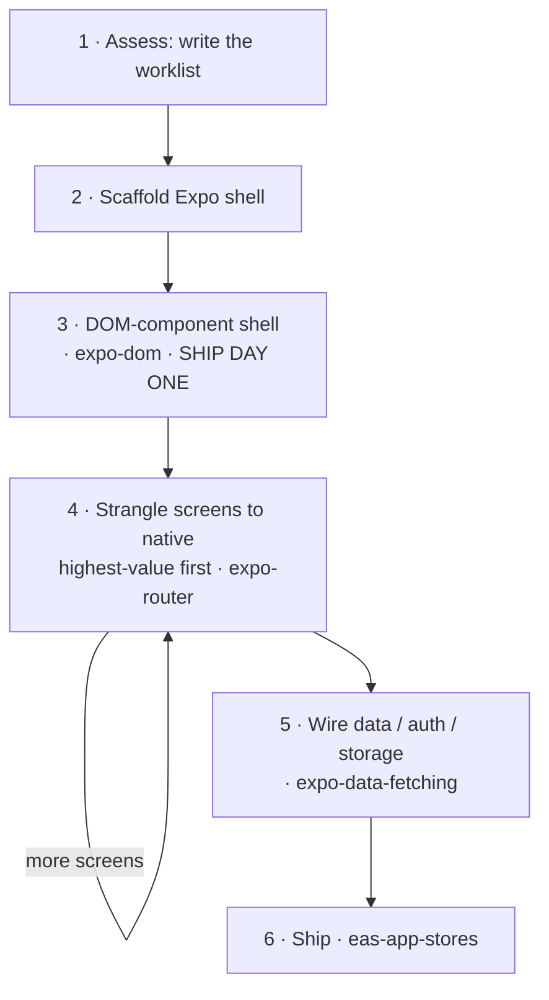

# Web to Native

A web React app does not *convert* to native — there is no transpiler. It **migrates**, screen by screen, the way a strangler fig grows around a tree and slowly replaces it: stand up a native shell, run the whole web UI inside it on day one, then strangle each screen into native in priority order. This skill is the spine that orders the work; each step hands off to an existing Expo skill rather than re-explaining it. It operationalizes Expo's [From Web to Native with React](https://expo.dev/blog/from-web-to-native-with-react) — read that for the why.

## Principles

- **Migrate, don't rewrite.** Never big-bang it; every step keeps the app shippable.
- **Ship on day one.** The web UI runs in a DOM-component shell (step 3) before anything is nativized — that's the milestone; everything after is polish.
- **Strangle by value.** Nativize the hot screens; leave the rest in the webview. Each DOM screen carries a ~2 MB web runtime — reason enough not to ship everything as DOM.
- **Nativize means redesign, not reskin.** A strangled screen should look like Apple/Google shipped it, not the web page reskinned. **Reach for `@expo/ui` first** - it renders real SwiftUI/Compose, so it feels *exactly* like the OS; styled RN primitives are the fallback for custom layouts only. Plus platform navigation (`expo-router`: NativeTabs, large titles), liquid glass and native components via `@expo/ui`, and mobile UX (sheets, swipe, haptics). The web→native pattern map is [`./references/native-patterns.md`](./references/native-patterns.md). If it still feels like a website, you ported instead of redesigned.
- **Verify by running, not compiling.** A clean build proves nothing (a blank webview compiles fine). Run each screen — but judge *content and behavior* against the web original, not pixels (a nativized screen should look more native, not identical).
- **Orchestrate, don't reinvent.** Each step routes into an existing skill. The value here is the *order* and the *gotchas* — the idiom-by-idiom mappings live in [`./references/false-friends.md`](./references/false-friends.md).

## Run it as a loop (recommended)

The migration is a long repeat-until-done loop, so the first move is to **write the goal objective and launch it** — not to grind screens by hand. Fill the objective in [`./references/run-as-goal.md`](./references/run-as-goal.md) for this app and present it; it **re-reads this skill every iteration**, so each `/goal` turn reloads the playbook + worklist and drives the next screen (it even self-bootstraps the assess step). Then run `/goal` with it — or, if the harness can't loop, write it to `migration-goal.md` and have the user launch it. The steps below are what each iteration does; run them by hand only if you're not looping.

## The migration

> **No repo to migrate** - just building native fresh as a web dev? You don't need these steps: use `expo-router`, and keep [`./references/false-friends.md`](./references/false-friends.md) open for the web→native idiom map. Everything below assumes an existing web app.

### 1. Assess → write the worklist

Read the repo and produce `migration-progress.md`, the durable worklist the rest of the migration checks off. Make two cuts:

- **Screens vs backend.** Page routes (`page.tsx`) are screens you migrate; server routes (`route.ts`), the ORM, and auth handlers stay server-side. Decide the backend once: keep it deployed (the native app becomes an HTTP client) or move it to EAS Hosting (`eas-hosting`).
- **Bucket each screen** by how it should land: **port-as-is** (presentational → ships in a DOM webview), **nativize-now** (hot, or needs native feel — gestures, lists, keyboard), **nativize-later**, or **hybrid** (a native shell around a web sub-tree, e.g. a chat list wrapping a markdown renderer).

Note the framework signals as you read — RSC vs client, Tailwind/shadcn, where data is fetched — since they decide how each screen ports (false-friends has the mappings; async Server Components in particular must be split into a client fetch + a presentational component before they can move). **Flag third-party services/SDKs too** — browser SDKs don't carry over (`false-friends` → *Services & SDKs*); payments especially is a *fork, not a swap* (in-app digital goods must use store IAP via RevenueCat, ~30% — not Stripe), a business-model call to make now, not at App Store review. The worklist is only trustworthy once every route is sorted and every screen bucketed.

### 2. Scaffold the shell

`create-expo-app`, then mirror the web routes in Expo Router — Next's tree maps almost 1:1 (note `[id]/page.tsx` → `[id].tsx`, and routes may live in `src/app/`). Empty screens, one per route.

### 3. Shell it in DOM components — the day-one milestone

Bring every screen over as a DOM component (`'use dom'`, per the `expo-dom` skill) rendered by its native route, so the whole app runs on a phone before anything is nativized. Expect per-screen edits - unwrapping Server Components, swapping framework imports (`next/link`), carrying the styling over - all covered in false-friends. Then verify by running (below); this is shippable to TestFlight as-is.

### 4. Strangle screens to native — by value

Walk `migration-progress.md` top-down. For each screen, *redesign* it native - don't port the web layout. Reach for **`@expo/ui` first** (real SwiftUI/Compose - buttons, lists, sheets, pickers, sliders; [`./references/native-patterns.md`](./references/native-patterns.md) maps which web pattern becomes which native component), then platform navigation (`expo-router` - NativeTabs, large titles) and mobile UX (swipe, haptics, momentum/inverted scroll); RN primitives only for custom layouts. Consult [`./references/false-friends.md`](./references/false-friends.md) for each idiom. `@expo/ui` and DOM components both run in **Expo Go** (SDK 56+) - a dev build (the `expo-dev-client` skill) is only needed for *custom* native modules. Verify *content and behavior* against the running web original (the look should become more native), then check it off. One screen per pass, app shippable throughout. It's a loop over a durable worklist, so it can run unattended - hand it to a goal loop ([`./references/run-as-goal.md`](./references/run-as-goal.md)).

### 5. Wire data, auth, and storage

The web data layer doesn't survive the move - relative fetches, cookie sessions, `localStorage`, and env vars all change (swaps in false-friends). Use `expo-data-fetching` for requests and caching; add `eas-hosting` if the backend moved to EAS Hosting.

### 6. Ship

`eas-app-stores` for the store builds (App Store / Play / TestFlight), EAS Update for OTA pushes after.

## Verify by running, not compiling

A green `expo export` proves a screen *bundles*, not that it *renders* — a screen can build and still render blank or mis-render. So after the shell and after every nativized screen, compare the two **running** apps for the same route:

- **Web original** — capture it with **`agent-browser`** (vercel-labs CLI): `open` the route, `snapshot --json` the accessibility tree, `screenshot`.
- **Native** — drive the simulator with **`argent`**: `describe` / `debugger-component-tree` for structure, `flow` to replay the check each pass.

Pass on parity of **content and behavior** — not pixels: a nativized screen should look *more* native than the web, never identical (the DOM-shell stage is the exception — there it *is* the web UI, so it should match). Feel is part of native and can't be screenshotted — for screens with transitions or gestures, capture a short recording, not just a still (see `native-patterns.md` → Feel). This loop is **opinionated about its tooling**: if `agent-browser` or `argent` isn't installed, ask the user and install it before proceeding — don't fall back to manual screenshots. Full recipe and setup in [`./references/verify-on-device.md`](./references/verify-on-device.md).

## References

- [`./references/false-friends.md`](./references/false-friends.md) — web idiom → native equivalent + the gotcha for each. The lookup for steps 3–5, and for any web dev unlearning idioms.
- [`./references/native-patterns.md`](./references/native-patterns.md) — web UX *pattern* → native redesign (`@expo/ui`-first). The step-4 redesign playbook so screens feel OS-native, not reskinned.
- [`./references/verify-on-device.md`](./references/verify-on-device.md) — the two-agent parity recipe: drive the web app (browser agent) and the native app (argent), open the same route, compare.
- [`./references/run-as-goal.md`](./references/run-as-goal.md) — a ready-shaped, migration-specific goal objective for driving step 4 unattended (re-reads this skill each iteration).
- [Expo — From Web to Native with React](https://expo.dev/blog/from-web-to-native-with-react) — the canonical guide this skill operationalizes.
