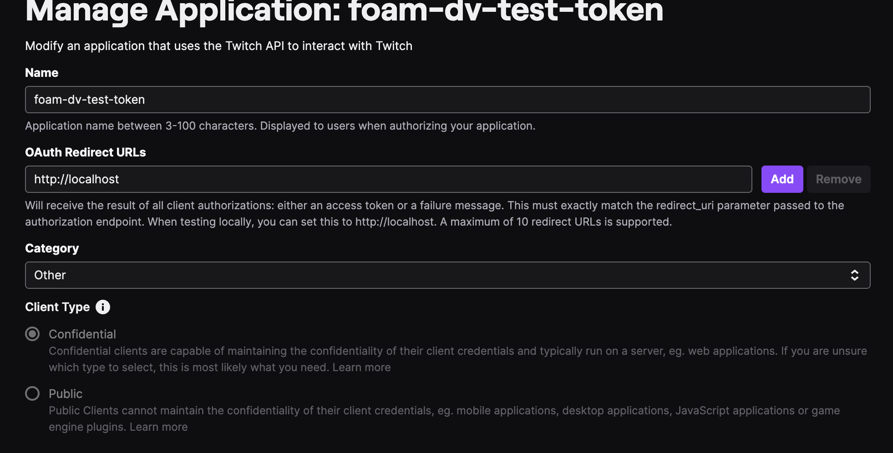

# foam

## Why?

To improve my React native skills and learn various other tech

The native Twitch app experience doesn't quite line up with the desktop experience and it lacks support for third-party extensions that many people use to express themselves in chat. This project aims to be a mobile alternative that supports these extensions and provides a cleaner and more intutive UI.

## Store links

TBA

## Features

TBA

## Environments

TBA

## Getting started

You will need the following in order to run the project locally:

- [Node.js](https://nodejs.org/en/)
- [NVM](https://github.com/nvm-sh/nvm)
- [Xcode](https://developer.apple.com/xcode/)
- [Android Studio](https://developer.android.com/studio) - optional
- [PNPM](https://pnpm.io/)

Once you have the above installed, you can run the following commands to get started:

Install correct node and package manager versions

```bash
 nvm use
 nvm install
 corepack enable
```

If for whatever reason `corepack enable` doesn't work you can run the following script to install the right version of PNPM:

```bash
PNPM_VERSION=$(node -e "console.log(require('./package.json').engines.pnpm)")
curl -fsSL https://get.pnpm.io/install.sh | env PNPM_VERSION=$PNPM_VERSION sh -
```

Install dependencies

```bash
pnpm i
```

Acquire Twitch API credentials

- Create a Twitch account if you do not have one already
- Go to the [Twitch developer console](https://dev.twitch.tv/console/apps/create) and create a new application. Your OAUTH redirect settings should look like the following:



- Copy the client ID and client secret and paste them into a `.env` file in the root of the project. See `.env.example` for an example of what this file should look like

### How to run the app

> **Note:** You will need to have an Android emulator running in order to run the app locally. You will need to use the AVD (android virtual device) manager in Android Studio to create a virtual device if you do not have one already.

> **Note:** You'll need to have Xcode installed in order to run the iOS app locally.

> **Note:** You'll need to start the proxy server to proxy authentication requests to Twitch. You can do this by running `pnpm run start:proxy` in a separate terminal window.

## Contributing

### Commiting code

This project follows the [Conventional Commits](https://www.conventionalcommits.org/en/v1.0.0/) specification. [Husky](https://github.com/typicode/husky) is used to execute scrips according to git hooks in order to test if a developer is following the various linting rules and conventional commits. Run `yarn commit` to start an interactive commit.

### Bug reports

If you encounter a problem with this project, please open an issue. Be sure to include:

- Node version
- OS
- Brief but thorough reproduction steps of the issue
