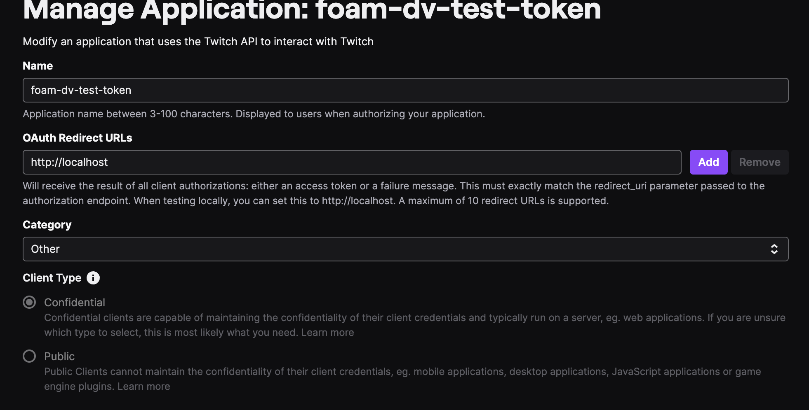
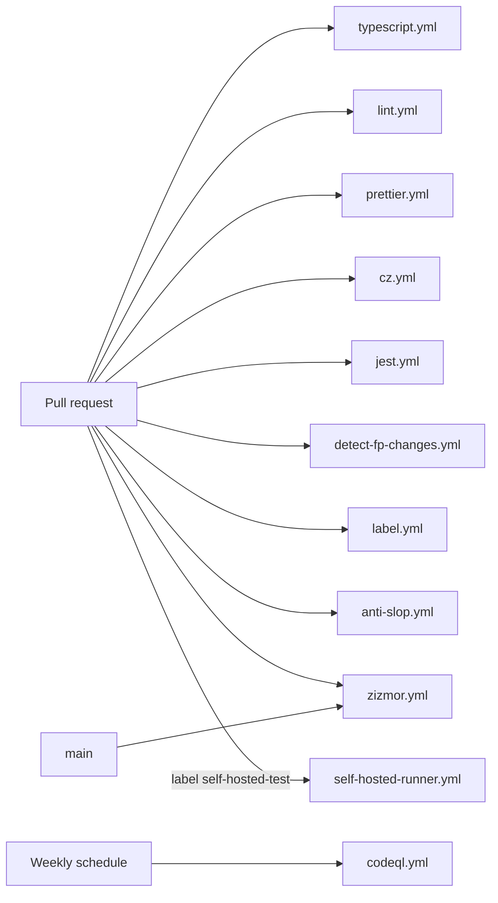
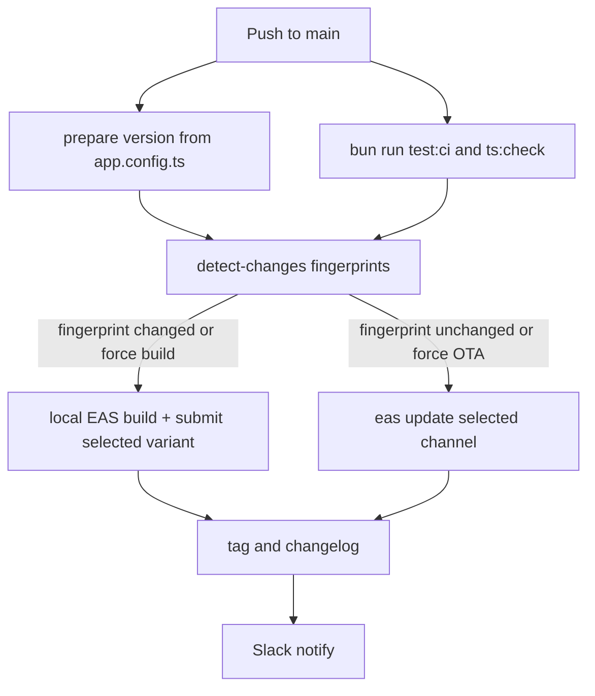
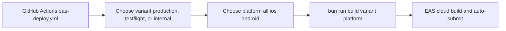
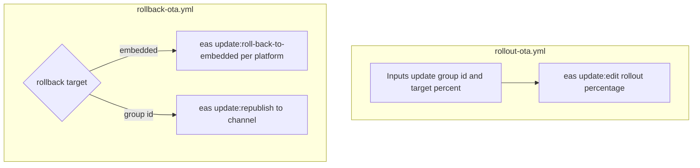

# Foam mobile app

[](LICENSE.MD)

A new way to experience Twitch.tv on mobile

<p>
  
  
</p>

## Why?

To improve my React native skills and learn various other tech

The native Twitch app experience doesn't quite line up with the desktop experience and it lacks support for third-party extensions that many people use to express themselves in chat. This project aims to be a mobile alternative that supports these extensions and provides a cleaner and more intuitive UI.

# Table of contents

- [Foam mobile app](#foam-mobile-app)
- [Why](#why)
- [Table of contents](#table-of-contents)
- [Project structure](#project-structure)
- [Store links](#store-links)
- [Features](#features)
- [Architecture and performance](#architecture-and-performance)
- [Getting started](#getting-started)
- [Contributing](#contributing)
- [CI/CD](#cicd)
- [Release process](#release-process)
- [Testers management](#testers-management)
- [Debugging](#debugging)
- [Managing access to the project and associated services](#managing-access-to-the-project-and-associated-services)
- [API dependencies](#api-dependencies)
- [Markdown writing guide](#markdown-writing-guide)
- [Bug reports](#bug-reports)
- [License](#license)

# Project structure

This is a [React Native app](https://reactnative.dev). This repository powers the mobile app and several [Expo app variants](https://docs.expo.dev/tutorial/eas/multiple-app-variants/) (see [`app.config.ts`](app.config.ts)):

1. **`production`** — Store release app.
2. **`testflight`** — Public TestFlight invite build (`foam-testflight`).
3. **`internal`** — Internal QA distribution build (`foam-internal`).
4. **`development`** — Local development and dev-client installs.
5. **`e2e`** — Deterministic UI tests with a mock server.

Each variant uses different iOS bundle identifiers and Android application ids so multiple builds can be installed on one device.

Inspiration on how this project is structured is coming from: [Obytess React Native Starter](https://starter.obytes.com/), [Aetherspace Green Stack Starter](https://github.com/Aetherspace/green-stack-starter-demo#readme), [online docs as Storybook website](https://main--62c9a236ee16e6611d719e94.chromatic.com/?path=/story/aetherspace-quickstart--page), [Infinite Red cookbook for React Native](https://ignitecookbook.com/).

## Store links

TBA

## Features

TBA

# Architecture and performance

Foam is built around the high-churn parts of Twitch: live playback, fast chat, third-party emotes, badges, and cosmetics. The app keeps that path responsive by keeping chat state local, windowed, cached, and measurable.

## Performance

Chat uses [`@legendapp/list`](https://github.com/LegendApp/legend-list) for virtualized chat rows, bounded message windows, buffered message flushing, memoized row rendering, cached visible-message filtering, and precomputed chat text height where possible.

Performance checks live in a few layers:

- `bun run test:perf` runs the Reassure suite for CI-friendly regression checks.
- `bun run perf:chat:rn` captures React DevTools profiles for chat.
- `bun run perf:chat:rn:diff` compares React DevTools profiles.
- `bun run perf:chat:ios` captures native iOS Instruments traces.
- `bun run perf:chat:ios:export` exports Instruments traces for inspection.

When changing chat rendering, parsing, scrolling, or scheduling, prefer measuring the real path over simplified mocks. The chat perf tests should model `LegendList` virtualization behavior closely enough that regressions reflect the behavior in the real world

## Legend State

Chat state uses [Legend State](https://legendapp.com/open-source/state/) so frequent message, emote, badge, and cosmetic updates can avoid broad React re-renders. The chat store is split by responsibility under [`src/store/chat`](src/store/chat):

- [`observables`](src/store/chat/observables) contains module-level observables such as `chatStore$`.
- [`actions`](src/store/chat/actions) contains write helpers and pure transforms that read or mutate observables.
- [`react`](src/store/chat/react) contains selector hooks for components.
- [`types`](src/store/chat/types) contains shared chat contracts and constants.

Components should import those modules directly instead of importing `@legendapp/state` primitives themselves. Session-scoped render caches, such as mention colors and lightened colors, live on `chatStore$.sessionCaches`; persisted channel data, such as emotes, badges, recent messages, and provider fallback data, lives under `chatStore$.persisted`.

## Image caching

Chat renders many repeated remote images: Twitch badges, third-party emotes, 7TV cosmetics, thumbnails, and preview assets. The shared [`Image`](src/components/Image/Image.tsx) wrapper and chat inline image renderer route those URLs through [`src/utils/image/image-cache.ts`](src/utils/image/image-cache.ts) before handing them to `expo-image` or `react-native-nitro-image`.

The native cache stores files in Expo's cache directory under `chat-img-cache` and keeps an MMKV manifest keyed by source URL plus cache variant. Variants such as `emote`, `badge`, and `image` keep different asset classes from colliding. Downloads are deduplicated, priority queued (`visible`, `interactive`, `background`), capped at four concurrent downloads, and evicted by least-recent access when the cache exceeds 100 MB or 5000 records.

Visible chat assets are warmed aggressively. Incoming visible badge and emote URLs are cached with `visible` priority, emote sheets warm uncached emote variants with `interactive` priority, and cached file URLs are prefetched once they resolve. On web, the same wrapper uses cacheable object URLs and revokes unused downloads when a component unmounts.

## Networking

All outbound HTTP goes through [`createApiClient`](src/services/api/Client.ts), which produces one tagged client per upstream in [`src/services/api/clients.ts`](src/services/api/clients.ts): `twitchApi`, `bttvCachedApi`, `sevenTvApi`, `ffzApi`, and `streamElementsApi`. The factory centralizes the cross-cutting concerns so the per-service modules under [`src/services`](src/services) stay thin: case-insensitive header merging (Helix rejects duplicated `Client-Id` headers), bearer-token injection, a typed `ApiError` that carries the HTTP `status`, and Sentry recording for both network failures and non-2xx responses (fingerprinted per service + method + path + status so each broken endpoint is one issue).

### Request timeouts

Every request is bounded by an `AbortController` (default **10s**, override per client with the `timeout` option). A timed-out request aborts the connection, records a `timeout` Sentry event, and throws `ApiError` with status `408`.

This matters because Foam depends on third-party emote and cosmetic services (7TV, BTTV, FFZ, StreamElements) that degrade independently of Twitch. When one stalls without closing the socket the underlying `fetch` never rejects — and react-query's `retry` only fires on rejection, so an unbounded request would leave the query `pending` forever. The timeout converts a silent hang into a retryable error.

## Internationalization (i18n)

Foam uses [i18next](https://www.i18next.com/) with [react-i18next](https://react.i18next.com/), initialized in [`src/i18n/i18next.ts`](src/i18n/i18next.ts). On launch the active language is detected from the device locale via `expo-localization`, falling back to `en` when the device language isn't in `supportedLanguages`.

English (`src/i18n/locales/en.ts`) is the source of truth and currently the only shipped locale. Strings are grouped into namespaces (`common` is the default), including `chat`, `stream`, `settings`, `preferences`, `search`, `auth`, `onboarding`, `errors`, and `feedback`. Key typing comes from [`src/i18n/i18n.d.ts`](src/i18n/i18n.d.ts), which feeds the `en` resources into i18next's `CustomTypeOptions` so `t()` keys are autocompleted and type-checked.

Conventions:

- In components, prefer the `useTranslation` hook (array form when a component pulls from more than one namespace).
- In hot chat-row render paths, toasts, and plain module-level functions where a hook can't run, call `i18next.t('namespace.key')` directly.
- For option arrays (settings pickers, segmented controls), store a `labelKey` on each option and resolve it at render time rather than baking translated strings into config.

To add a language: copy `en.ts` to a new locale typed against the `en` export so TypeScript flags missing keys, then register it in `resources`, `supportedLanguages`, and `LANGUAGE_LABELS` in `src/i18n/i18next.ts`.

# Getting started

You will need the following in order to run the project locally:

- [Node.js](https://nodejs.org/en/)
- [NVM](https://github.com/nvm-sh/nvm)
- [Xcode](https://developer.apple.com/xcode/)
- [Android Studio](https://developer.android.com/studio)
- [bun](https://bun.sh/)

See [Expo React Native project](https://docs.expo.dev/get-started/set-up-your-environment/), on how to prepare your environment first. (For more-in-depth understanding of React Native projects navigate to [React Native docs](https://reactnative.dev/) and [Expo docs](https://docs.expo.dev/)).

1. Clone this repository

- `git clone --recurse-submodules https://github.com/luke-h1/foam`
- If you already cloned without submodules, run `git submodule update --init`

2. Install `bun`

- ```bash
    version=$(cat .bun-version)
    curl -fsSL "https://bun.sh/install" | bash -s "bun-v$version"
  ```

3. Ensure you're on the correct Node version

- ```bash
  nvm use
  nvm install
  ```

4. Install dependencies

- `cd foam`
- `bun install`

5. Acquire Twitch API credentials

- Create a Twitch account if you do not have one already
- Enable 2FA on your account otherwise you'll not be able to create apps via the developer console
- Go to the [Twitch developer console](https://dev.twitch.tv/console/apps/create) and create a new application. Your OAUTH redirect settings need to look like the following (in order for it to work with the authentication proxy):



- Copy the client ID and client secret and paste them into a `.env` file in the root of the project. See `.env.example` for an example of what this file should look like

- If you're on Linux or windows, you'll need to setup Android studio and install a device to run the app.

- If you're on Mac you can just use the iOS simulator (via Xcode) to run the app

6. Start the local proxy server
   The local proxy lives in `local-proxy/proxy.ts` and runs with Bun's HTTP server. It proxies authentication requests to Twitch because Twitch redirect URLs must use `http` or `https`. In TestFlight, TestTrack and production, the auth proxy is an AWS Lambda behind API Gateway.

- `bun run start:proxy`

- If port `4000` is already in use, override it with `PORT=4100 bun run start:proxy`
- If you need to bind a specific interface, set `HOST`, for example `HOST=127.0.0.1 PORT=4100 bun run start:proxy`

7. Install development build on your simulator

- `bun run prebuild`

8. Run the app

- `bun run ios`
- `bun run android`

## Recommended dev environment

1. Mac - due to being able to run xcode and android simultaneously

_IOS_:

- Any IOS commands requires Xcode to be installed.
  - A simulator must be preconfigured in Xcode settings.
    - if no iOS versions are available, install the iOS runtime at `Xcode > Settings > Platforms`.
    - if the simulator download keeps failing you can download it from the developer website.
      - [Apple Developer](https://developer.apple.com/download/all/?q=Simulator%20Runtime)
      - `sudo xcode-select -s /Applications/Xcode.app`
      - `xcodebuild -runFirstLaunch`
      - `xcrun simctl runtime add "~/Downloads/iOS_17.4_Simulator_Runtime.dmg"` (adapt the path to the downloaded file)
  - In addition, ensure Xcode Command Line Tools are installed using `xcode-select --install`.
- Expo will require you to configure Xcode Signing. We use automatic signing which let's expo deal with the signing so we don't have to do it manually.
- Make sure you do have automatic signing setup properly. Open the project in xcode (`cd ios && xed .`) > select the project > Signing & Capabilities > check `Automatically manage signing` and select a team + unique bundle identifier

_Android_:

- Install "Android Studio"
  - Make sure you have the Android SDK installed (Android Studio > Tools > Android SDK).
    - In "SDK Platforms": "Android x" (where x is Android's current version).
    - In "SDK Tools": "Android SDK Build-Tools" and "Android Emulator" are required.
    - Add `export ANDROID_HOME=/Users/<your_username>/Library/Android/sdk` to your `.zshrc` or `.bashrc` (and restart your terminal).
  - Setup an emulator (Android Studio > Tools > Device Manager).

## Tips

- To run on your phone (ensure connected via a cable) add `-- --device` to your command (i.e. `bun run ios -- --device`).
- If the Android simulator frequently hangs or is very slow, [bump its memory limit](https://stackoverflow.com/a/40068396)

## Running `development` version of the app locally

In order to run the `development` variant of the app locally you will need to run:

1. `bun run prebuild` - prebuilds the native part of the app (generates `ios` & `android` folders)
2. `bun run ios` - Builds the native part of the app & runs it on iOS
3. `bun run android` - Builds the native part of the app and runs it on Android
4. `bun run start` - once the native part of the project is installed on the emulator/simulator/your physical device you can run the JS metro server
   - this will start the JS server that bundles and serves a hot-reloaded version of the JS app
   - JS server will start automatically when running `bun run ios` or `bun run android`

## Troubleshooting iOS native builds (RNRepo)

This project uses [RNRepo](https://rnrepo.org) (`@rnrepo/expo-config-plugin` + its CocoaPods/Gradle build-tools) to swap some native modules for prebuilt binaries and speed up native builds. On **iOS**, RNRepo's prebuilt XCFrameworks currently 404 on rnrepo.org for the Expo core modules (`expo`, `expo-modules-core`, `expo-dev-launcher`, `expo-dev-menu`, `expo-log-box`) on our RN/SDK combo, so it falls back to building them from source anyway — but leaves behind a build phase and a half-configured Pods project that only "works" while DerivedData is warm.

Because of this, **all iOS scripts disable RNRepo** by setting `DISABLE_RNREPO=true` (see `package.json`: `ios`, `ios:production`, `prebuild`, `prebuild:ios`, `e2e:dev:ios`, `e2e:prebuild`, `build:debug:ios`, `build:local:production:ios`). The release path (`bun run build:local`, via `scripts/build.sh`) does the same. Android keeps RNRepo enabled — its Gradle prebuilds work fine.

### Symptoms

You'll hit this when DerivedData is cleared, the simulator/Pods are wiped, or a native dependency is upgraded **without** reinstalling pods from source. The iOS build fails with errors like:

```text
ios/Foamdev/AppDelegate.swift:1:17: error: no such module 'Expo'
<unknown>:0: error: module map file '.../Build/Products/Debug-iphonesimulator/Expo/Expo.modulemap' not found
```

A related variant after upgrading a native pod (e.g. `@sentry/react-native`) is a stale compiled module: `cannot find 'RNSentrySDK' in scope`. That one is a stale **DerivedData** module cache — clearing it forces the rebuild, which then surfaces the RNRepo issue above if pods were installed with RNRepo enabled.

### Fix

Reinstall pods from source with RNRepo disabled, then build:

```bash
# regenerate the Pods project from source (rewrites the gitignored ios/Podfile.lock)
DISABLE_RNREPO=true pod install --project-directory=ios

# then build — the bun scripts already set DISABLE_RNREPO=true for you
bun run ios
```

If a stale compiled module is also involved, clear that build's DerivedData first:

```bash
rm -rf ~/Library/Developer/Xcode/DerivedData/Foamdev-*
```

> [!NOTE]
> Just setting `DISABLE_RNREPO=true` at `xcodebuild` time is **not** enough on its own — the flag is only read by RNRepo's pre/post-install hooks, so you must re-run `pod install` (or any `prebuild`/`run:ios` script, which run it for you) to regenerate the Pods project without the prebuilt setup. Re-enable RNRepo on iOS once rnrepo.org publishes matching iOS XCFrameworks.

## Remote build cache

This project enables Expo's [remote build cache](https://docs.expo.dev/guides/cache-builds-remotely/) via the EAS provider. When running `bun run ios` / `bun run android` (or `expo run:*`), Expo will look up a matching fingerprint on EAS and download a previously built binary if the native code hasn't changed — skipping a full local native build.

Config lives in [`app.config.ts`](app.config.ts) under `expo.experiments.buildCacheProvider`, with `eas-build-cache-provider` declared as a devDependency. Make sure you're logged in with `eas login` and have an EAS project linked (already configured in `app.config.ts` via `extra.eas.projectId`).

## PR previews & channel surfing

Comment `!surf-deploy` on a pull request to publish an EAS Update to a `pr-<N>` branch on the `development` channel (see [`.github/workflows/ota-surf.yml`](.github/workflows/ota-surf.yml)). The workflow posts a QR code as a comment on the PR.

To preview a PR on a device that already has the internal/dev client installed:

1. **Scan the QR** posted on the PR — it opens the dev client directly into that PR's JS bundle.
2. **Or surf in the launcher:** open the dev client → Extensions → EAS Update → pick branch `pr-<N>`. Any branch in the project is loadable as long as the runtime version matches the installed build (we use `policy: 'appVersion'`).

Re-running surf on the same PR updates the existing QR comment. Fork PRs are skipped (no access to `EXPO_TOKEN`).

## Storybook

Storybook is currently configured to preview UI components on app. Eventually the plan is to deploy this storybook somewhere on web

> [!WARNING]
> If you add a new `.stories.tsx` file, you need to run `bun run storybook:generate` to re-generate the list of all available stories.

## Running `production` variant of the app locally

To run the `production` variant of the app locally, you'll need to follow these steps. This is useful for testing the production build configuration, verifying store-ready builds, or debugging production-specific issues.

> [!WARNING]
> The production variant uses different bundle identifiers and package names, so it can be installed alongside the development version on the same device.

### Prerequisites

1. **Environment Setup**: Ensure you have all the development environment requirements from the [Getting started](#getting-started) section
2. **Production Credentials**: You'll need production-specific credentials and configuration files:
   - Production Google Services files (`GoogleService-Info-prod.plist` for iOS, `google-services-prod.json` for Android)
   - Production environment variables in your `.env` file
   - Valid Apple Developer account and signing certificates for iOS

### Steps

1. **Set up production environment variables**

   Ensure your `.env` file contains the correct values

2. **Start the local proxy server** (if needed for local testing and not using the auth proxy lambda)

   ```bash
   bun run start:proxy
   ```

3. **Run the production app**

   **For iOS:**

   ```bash
   bun run ios:production
   ```

   **For Android:**

   ```bash
   bun run android:production
   ```

   These commands will:
   - Build the native app with production configuration
   - Install it on your simulator/device
   - Start the Metro bundler for the JavaScript code

### Alternative: Using EAS Build for Local Testing

If you want to test the exact production build that would be submitted to the stores, you can use EAS Build:

1. **Build locally with EAS**

   ```bash
   # For iOS
   eas build --profile production --platform ios --local

   # For Android
   eas build --profile production --platform android --local
   ```

2. **Install the built app**

   The built `.ipa` (iOS) or `.apk` (Android) files will be in the `builds/` directory and can be installed on your device.

### Troubleshooting

- **Bundle identifier conflicts**: If you get signing errors, ensure your Apple Developer account has the production bundle identifier (`foam-tv`) registered
- **Missing credentials**: Verify all production Google Services files are present and valid
- **Environment variables**: Double-check that all required production environment variables are set correctly
- **Build failures**: Check the EAS build logs for detailed error information

### Key Differences from Development

- Uses production bundle identifier (`foam-tv` for iOS, `com.lhowsam.foam` for Android)
- App name shows as "Foam" (without dev suffix)
- No development badge on the app icon
- Uses production API endpoints and credentials
- Optimized for performance and store submission

## Running QA variants locally

Use the same prerequisites as production (correct Google services files, env vars, signing), but point at the **internal** or **testflight** Firebase / config files from [`app.config.ts`](app.config.ts). Then run with the matching `APP_VARIANT`, for example:

```bash
APP_VARIANT=internal expo run:ios
APP_VARIANT=testflight expo run:ios
```

For store-parity binaries, use `eas build --profile internal` or `eas build --profile testflight` (cloud or `--local`) as in [Local EAS build](#local-eas-build).

# Contributing

## Commit strategy - conventional commits

This project follows the [Conventional Commits](https://www.conventionalcommits.org/en/v1.0.0/) specification. [Husky](https://github.com/typicode/husky) is used to execute scripts according to git hooks in order to test if a developer is following the various linting rules and conventional commits. Run `bun commit` to start an interactive commit. Please familiarize yourself with the [specification](https://www.conventionalcommits.org/en/v1.0.0/#specification).

Example:

```
feat(chat): improve readability of username
chore(deps): update `react-native` to `0.80.0`
fix(streams): fix crash on `LiveStreamScreen`
```

## Git flow & pull requests

1. For every change, create a new branch from `main`
2. Use conventional commits for your commits and other good practices to help ease the review process
3. Open a PR against `main` & title it using the pattern mentioned in [Conventional Commits](https://www.conventionalcommits.org/en/v1.0.0/).
   - Provide a proper description of the changes
   - Include some screenshots/videos of the change if applicable
   - Ensure to test your changes on a physical device as sometimes the simulator works but on a real device it breaks

4. Assign a reviewer to the PR
5. After the PR is approved & the checks pass, merge it to `main`
6. Merging to `main` runs [`deploy-ota-or-native.yml`](.github/workflows/deploy-ota-or-native.yml), which publishes a production [EAS Update](https://docs.expo.dev/eas-update/introduction/) when native fingerprints are unchanged, or builds and submits store binaries when native code changes (see [Deploy flows](#deploy-flows)). For **internal**, **testflight**, or **production** cloud builds without going through that pipeline, use the manual workflow [`eas-deploy.yml`](.github/workflows/eas-deploy.yml) in GitHub Actions.

## Import aliases

We use [tsconfig-paths](https://github.com/dividab/tsconfig-paths) to alias imports.

## dev-builds

Sometimes you may want to run the app on your device to check your changes, see how it looks on a real device etc. In order to do this you need to run some steps to configure your device for the first time.

1. Connect your phone via cable to your laptop/machine (you must ensure both devices are on the same network, otherwise this will not work.). Make sure to trust the phone/laptop when prompted.

2. Open the project in Xcode: `cd ios && xed .` Make sure to login to xcode if you haven't already

3. Your phone will then pair + connect to xcode. Let that complete

4. When prompted select the project and click the 'hide code' button in the top-right

5. Navigate to signing & capabilities

6. Select your team, ensure the bundle identifier matches the dev variant (for example `foam-tv-dev` from [`app.config.ts`](app.config.ts), or another unique id) and select your device from the dropdown `Foam > YourPhoneName`

7. Run a build by clicking the play button

8. The app will then install on your device and run. Hot reloading will also work

If you get an error such as `no development servers found` then this means the laptop and/or phone is on a different network.

# CI/CD

## CI

Pull requests run checks in [`.github/workflows/`](.github/workflows/):

| Workflow                                                             | Trigger                                                                               | Purpose                                                                                                                   |
| -------------------------------------------------------------------- | ------------------------------------------------------------------------------------- | ------------------------------------------------------------------------------------------------------------------------- |
| [`typescript.yml`](.github/workflows/typescript.yml)                 | Pull requests                                                                         | Runs `bun run ts:check`.                                                                                                  |
| [`lint.yml`](.github/workflows/lint.yml)                             | Pull requests                                                                         | Runs ESLint with `bun run lint`.                                                                                          |
| [`prettier.yml`](.github/workflows/prettier.yml)                     | Pull requests                                                                         | Runs Prettier with `bun run format:check`.                                                                                |
| [`cz.yml`](.github/workflows/cz.yml)                                 | Pull requests                                                                         | Runs commitlint from `HEAD^1`.                                                                                            |
| [`jest.yml`](.github/workflows/jest.yml)                             | Pull requests                                                                         | Placeholder Jest workflow; currently echoes `bun run test` instead of executing it.                                       |
| [`detect-fp-changes.yml`](.github/workflows/detect-fp-changes.yml)   | Pull requests                                                                         | Compares Expo native fingerprints for `production`, `testflight`, and `internal` against the PR base and comments on PRs. |
| [`label.yml`](.github/workflows/label.yml)                           | Pull requests                                                                         | Applies labels via [labeler](https://github.com/actions/labeler).                                                         |
| [`anti-slop.yml`](.github/workflows/anti-slop.yml)                   | Pull requests via `pull_request_target`                                               | Runs `peakoss/anti-slop`, exempts draft PRs, and adds the `slop` label on failure.                                        |
| [`self-hosted-runner.yml`](.github/workflows/self-hosted-runner.yml) | Pull requests with the `self-hosted-test` label, or manual dispatch in `luke-h1/foam` | Runs `bun run lint` on the self-hosted `foam` runner.                                                                     |
| [`zizmor.yml`](.github/workflows/zizmor.yml)                         | Pull requests targeting `main`, and pushes to `main`                                  | Audits GitHub Actions workflows for security issues with [zizmor](https://github.com/zizmorcore/zizmor).                  |

Scheduled [CodeQL](.github/workflows/codeql.yml) runs weekly on the default branch.


```mermaid
flowchart LR
  PR[Pull request] --> TS[typescript.yml]
  PR --> Lint[lint.yml]
  PR --> Prettier[prettier.yml]
  PR --> CZ[cz.yml]
  PR --> Jest[jest.yml]
  PR --> FP[detect-fp-changes.yml]
  PR --> Label[label.yml]
  PR --> Slop[anti-slop.yml]
  PR --> Zizmor[zizmor.yml]
  PR -->|label self-hosted-test| SH[self-hosted-runner.yml]
  Main[main] --> Zizmor
  Schedule[Weekly schedule] --> CodeQL[codeql.yml]
```

## CI/CD security

Static analysis and GitHub Actions security are checked in two places:

| Workflow                                           | Trigger                                           | Purpose                                                                                               |
| -------------------------------------------------- | ------------------------------------------------- | ----------------------------------------------------------------------------------------------------- |
| [`zizmor.yml`](.github/workflows/zizmor.yml)       | Pull requests targeting `main`, and `main` pushes | Scans workflow YAML for unsafe permissions, injection risks, unpinned actions, and related CI issues. |
| [`codeql.yml`](.github/workflows/codeql.yml)       | Weekly schedule on the default branch             | Runs GitHub's static analysis and uploads results to code scanning.                                   |

Keep workflow permissions scoped to the smallest set each job needs, keep `persist-credentials: false` on checkout unless a job must push, and pin third-party actions to full 40-character commit SHAs instead of floating tags like `@v4`.

To get the hash for an action release tag, resolve the tag to the commit SHA and use that value in `uses:`:

```sh
git ls-remote https://github.com/actions/checkout "refs/tags/v4^{}" "refs/tags/v4"
git ls-remote https://github.com/zizmorcore/zizmor-action "refs/tags/v0.1.1^{}" "refs/tags/v0.1.1"
```

Prefer the `refs/tags/<tag>^{}` line when it exists; that is the commit behind an annotated tag. If only `refs/tags/<tag>` is returned, use that SHA. For an action without a release tag, inspect the upstream repository and pin a specific commit:

```sh
git ls-remote https://github.com/OWNER/REPO HEAD
```

After changing workflow action pins, run `zizmor` locally when available, or rely on [`zizmor.yml`](.github/workflows/zizmor.yml) to check the pull request before merge.

## CD

We use [EAS](https://docs.expo.dev/build-reference/eas/) to build, submit, ship [EAS Update](https://docs.expo.dev/eas-update/introduction/) payloads, and observe production startup performance with [EAS Observe](https://docs.expo.dev/eas/observe/introduction/).

There are four installable [variants](https://docs.expo.dev/tutorial/eas/multiple-app-variants/) today (each has distinct iOS bundle id and Android application id so they can sit side by side on one device):

1. **`production`** — Store release app; store profiles live in [`eas.json`](eas.json) (`production` build profile, `production` update channel).
2. **`testflight`** — Public TestFlight invite build (`testflight` profile and channel).
3. **`internal`** — Internal QA distribution builds (`internal` profile and channel). iOS devices must be [registered for ad hoc](https://docs.expo.dev/build/internal-distribution/) builds.
4. **`development`** — Local dev and dev-client installs only (`development` profile); not distributed from CI.

Additional build profiles (for example `e2e`) are used for Maestro E2E runs and CI; see [`eas.json`](eas.json).

## Deploy flows

Production delivery is automated on the default branch. Internal, TestFlight, and forced production deploys can also be kicked off manually from GitHub Actions.

| Workflow                                                                 | Trigger                                                                                                                                                                    | What it does                                                                                                                                                                                                                                                                                                                                                                                                            |
| ------------------------------------------------------------------------ | -------------------------------------------------------------------------------------------------------------------------------------------------------------------------- | ----------------------------------------------------------------------------------------------------------------------------------------------------------------------------------------------------------------------------------------------------------------------------------------------------------------------------------------------------------------------------------------------------------------------- |
| [`deploy-ota-or-native.yml`](.github/workflows/deploy-ota-or-native.yml) | Push to `main`, or **Run workflow** with `variant`, `deploy_type`, `platform`, `dry_run`, and `critical_update` inputs. Pushes default to `production`, `auto`, and `ios`. | Runs `bun run test:ci` and `bun run ts:check`, compares cached native fingerprints for the selected variant, then either publishes an OTA with `eas update --channel <variant>` using the local environment or runs local `eas build` + `eas submit`. OTA deploys update `CHANGELOG.md`; native deploys update `CHANGELOG.md` and create a GitHub Release. Sends Slack notifications when release metadata is produced. |
| [`eas-deploy.yml`](.github/workflows/eas-deploy.yml)                     | **Run workflow** with `variant` (`production`, `testflight`, `internal`) and `platform` (`all`, `ios`, `android`).                                                         | Runs the matching `bun run build:<variant>:<platform>` cloud EAS build script. The package scripts use `--no-wait`; iOS production and TestFlight scripts auto-submit. Requires `EXPO_TOKEN`.                                                                                                                                                                                                                           |
| [`rollout-ota.yml`](.github/workflows/rollout-ota.yml)                   | **Run workflow** with an OTA update group id and target rollout percentage.                                                                                                | Fetches the current rollout state and progresses an existing rollout with `eas update:edit --rollout-percentage`.                                                                                                                                                                                                                                                                                                       |
| [`rollback-ota.yml`](.github/workflows/rollback-ota.yml)                 | **Run workflow** with `channel`, `rollback_target`, and `platform`.                                                                                                        | Rolls the selected channel back to `embedded` by runtime version, or republishes a previous OTA update group to the selected channel.                                                                                                                                                                                                                                                                                   |
| [`e2e.yml`](.github/workflows/e2e.yml)                                   | **Run workflow** with optional `force_rebuild`.                                                                                                                            | Fingerprints the iOS `e2e` profile on the self-hosted `foam` runner, restores or builds a cached local EAS `.app`, optionally pushes an `e2e` OTA when the build is skipped, then runs the Maestro flows on `macos-latest`.                                                                                                                                                                                             |
| [`clear-cache.yml`](.github/workflows/clear-cache.yml)                   | **Run workflow**.                                                                                                                                                          | Deletes GitHub Actions caches while preserving OTA fingerprint and production OTA id caches.                                                                                                                                                                                                                                                                                                                            |

There is also a draft [EAS Workflows](https://docs.expo.dev/eas/workflows/get-started/) file at [`.eas/deploy-prod.yml`](.eas/deploy-prod.yml) (mostly commented / experimental); **GitHub Actions above are the source of truth** for how this repo deploys today.

### Default branch: native build vs OTA


```mermaid
flowchart TD
  A[Push to main] --> P[prepare version from app.config.ts]
  A --> T[bun run test:ci and ts:check]
  P --> D[detect-changes fingerprints]
  T --> D
  D -->|fingerprint changed or force build| B[local EAS build + submit selected variant]
  D -->|fingerprint unchanged or force OTA| U[eas update selected channel]
  B --> R[tag and changelog]
  U --> R
  R --> S[Slack notify]
```

The native-vs-OTA decision stores fingerprints in a private S3 bucket so the
same cache is available to GitHub Actions and local deploy scripts (also to avoid recent reliability issues with GHA). Configure
these fields in the `op://ci-cd/foam-staging` 1Password item, and export the
same values locally before running `bun run deploy -- ...` or
`bun run ota -- ...`:

- `FOAM_AWS_FINGERPRINT_ACCESS_KEY_ID`
- `FOAM_AWS_FINGERPRINT_SECRET_KEY`
- `FOAM_AWS_FINGERPRINT_BUCKET_NAME`

`FOAM_AWS_REGION` defaults to `eu-west-2` when it is not set.

The IAM user only needs read/write access to these object prefixes:

- `s3://<FOAM_AWS_FINGERPRINT_BUCKET_NAME>/fingerprints/*`
- `s3://<FOAM_AWS_FINGERPRINT_BUCKET_NAME>/ota-critical-index/*`
- `s3://<FOAM_AWS_FINGERPRINT_BUCKET_NAME>/ota-update-ids/*`

Use [`infrastructure/iam-fp-policy.json`](infrastructure/iam-fp-policy.json)
for an example IAM policy

### Manual EAS Deploy


```mermaid
flowchart LR
  H[GitHub Actions eas-deploy.yml] --> C[Choose variant production, testflight, or internal]
  C --> PL[Choose platform all ios android]
  PL --> E[bun run build variant platform]
  E --> EAS[EAS cloud build and auto-submit]
```

### OTA rollout and rollback


```mermaid
flowchart TD
  subgraph rolloutWf["rollout-ota.yml"]
    R1[Inputs update group id and target percent] --> R2[eas update:edit rollout percentage]
  end
  subgraph rollbackWf["rollback-ota.yml"]
    B1{rollback target}
    B1 -->|embedded| B2[eas update:roll-back-to-embedded per platform]
    B1 -->|group id| B3[eas update:republish to channel]
  end
```

## E2E testing

We use [Maestro](https://docs.maestro.dev/) for E2E testing. Flows live in `e2e/flows/` and run against a local mock server (`e2e/mock-server/`) for deterministic results — Twitch API, IRC chat, and emote/badge providers are all mocked.

### Quick start (local simulator)

```bash
# Install Maestro (one-time)
brew install mobile-dev-inc/tap/maestro

# Build + install the simulator app (one-time, or when native code changes)
bun run e2e:prebuild               # generate native projects for the e2e variant
bun run e2e:build:ios:sim          # xcodebuild → ios/build/...Foamdev.app
xcrun simctl install booted ios/build/Build/Products/Debug-iphonesimulator/Foamdev.app

# Run flows (three terminals)
bun run e2e:mock-server:dev                    # Terminal 1: Mock server
EXPO_PUBLIC_APP_VARIANT=e2e bunx expo start    # Terminal 2: Metro (e2e variant)
bun run e2e:test                               # Terminal 3: Flows
```

The local app is an expo-dev-client build: the launch subflow (`e2e/flows/common/launch.yaml`) deep-links it into Metro, so Metro **must** run with `EXPO_PUBLIC_APP_VARIANT=e2e` (that's what points the app at the mock server and skips onboarding). If Metro runs on a non-default port, pass `E2E_METRO_PORT`.

### Flows

| Flow                        | Covers                                                              |
| --------------------------- | ------------------------------------------------------------------- |
| `smoke.yaml` (tag: `smoke`) | App launches and the Top / Search / Settings tabs are present       |
| `navigation.yaml`           | Open a stream from Top, switch to the Categories segment            |
| `category.yaml`             | Category screen lists streams with a viewer count                   |
| `chat.yaml`                 | Stream screen renders the player and the chat input bar             |
| `following.yaml`            | Following tab hidden when signed out; sign-in entry point reachable |
| `search-and-settings.yaml`  | Channel/category search with filters; Settings → Dev Tools → Debug  |

### Writing flows

- Start every flow with `runFlow: common/launch.yaml` — it launches the app, suppresses the expo-dev-menu overlays, and (for dev-client builds) deep-links into Metro.
- Pass shared env through `scripts/e2e-maestro.sh` rather than hardcoding: flows receive `APP_ID`, `DEV_CLIENT`, and `DEV_CLIENT_URL`.
- Maestro launch `arguments` do **not** reach iOS `NSUserDefaults` — the wrapper script writes dev-menu preferences with `defaults write` into the simulator app container instead.
- Tag fast critical-path flows with `tags: [smoke]` so they run in `e2e:test:smoke`.

### Standalone build (for CI)

Creates a self-contained app with bundled JS - no Metro needed:

```bash
# Build standalone E2E app
bun run e2e:build:ios

# Run flows after installing the built `.app` on a booted simulator
bun run e2e:mock-server:dev               # Terminal 1
APP_ID=foam-tv-e2e DEV_CLIENT=false bun run e2e:test   # Terminal 2
```

### Commands

| Command                       | Description                             |
| ----------------------------- | --------------------------------------- |
| `bun run e2e:build:ios:sim`   | Build iOS simulator app (dev client)    |
| `bun run e2e:test`            | Run all Maestro flows                   |
| `bun run e2e:test:smoke`      | Run smoke flows only (`--include-tags`) |
| `bun run e2e:build:ios`       | Build standalone app (CI)               |
| `bun run e2e:build:android`   | Build standalone app (Android)          |
| `bun run e2e:mock-server:dev` | Start mock server (auto-reload)         |

Environment variables for `e2e:test` (see `scripts/e2e-maestro.sh`): `APP_ID` (default `foam-tv-dev`), `DEV_CLIENT` (default `true`), `E2E_METRO_PORT` (default `8081`).

### Troubleshooting

**Flows fail on a dev-menu sheet / launcher screen**

The expo-dev-menu onboarding sheet or the dev-launcher server picker can cover the app on a fresh install. `scripts/e2e-maestro.sh` writes the dev-menu preferences into the simulator app container before running, and the launch subflow deep-links past the server picker — but both need the app installed and the simulator booted first. Failure screenshots land in `~/.maestro/tests/<run>/`.

**Matchers: prefer testIDs**

Mock fixtures repeat across pagination pages, so text matchers can be ambiguous. Stable testIDs exist for the chat input (`chat-input-bar`), connecting placeholder (`chat-sync-placeholder`), player area (`stream-player-container`), top lists (`top-streams-list`, `top-categories-list`), and category header subtitle (`category-viewer-count`).

### OTA updates for E2E

The standalone E2E app supports OTA updates via the `e2e` channel, eliminating the need to rebuild for JS-only changes:

```bash
# Push JS update to E2E builds (no native rebuild needed)
eas update --channel e2e --message "Fix E2E test"
```

Only rebuild (`bun run e2e:build:ios`) when native code changes. Use fingerprinting to detect this automatically in CI.

### Build caching (EAS)

Local builds use EAS build caching to speed up `npx expo run:ios/android`. Builds are cached by fingerprint and reused when native code hasn't changed.

**How it works:**

- On `npx expo run:ios`, Expo checks EAS for a cached build matching the project fingerprint
- If found, downloads and uses it (skips compilation)
- If not found, compiles normally and uploads to EAS for future runs

No setup required - just ensure you're logged in with `eas login`.

## Local EAS build

Use this when you want binaries on your machine (parity with CI) or to avoid queue wait during iteration. Requires [EAS CLI](https://docs.expo.dev/build/setup/) and `eas login`.

```bash
# Cloud build (wait for Expo builders)
eas build --profile production --platform ios
eas build --profile internal --platform android
eas build --profile testflight --platform ios

# Compile on this machine (artifacts under ./build-artifacts or default EAS output)
eas build --profile production --platform ios --local
eas build --profile production --platform android --local
```

Profiles and channels are defined in [`eas.json`](eas.json). See [EAS Build](https://docs.expo.dev/build/introduction/) for credentials, credentials.json, and `--local` requirements (Xcode / Android SDK).

# Release process

The public app is distributed via the stores and is not in wide release yet. Shipping happens through **EAS Build**, **EAS Submit**, and **EAS Update** as described in [Deploy flows](#deploy-flows).

## Trigger a new production build

1. **Merge to `main`** — [`deploy-ota-or-native.yml`](.github/workflows/deploy-ota-or-native.yml) runs automatically. Use **Run workflow** on that file to force **OTA** or **build**, pick **platform**, or set **dry run** (skips release creation).
2. **Manual cloud build + submit** — GitHub → **Actions** → **EAS app deployment** ([`eas-deploy.yml`](.github/workflows/eas-deploy.yml)).
3. **From your machine** (uses EAS cloud builders, non-blocking with `--no-wait` as in npm scripts):

- `bun run build:production:android` — Android production build and auto-submit to Google Play
- `bun run build:production:ios` — iOS production build and auto-submit to App Store Connect
- `bun run build:internal:ios` / `build:internal:android` / `build:internal` — internal QA distribution builds
- `bun run build:testflight:ios` / `build:testflight` — public TestFlight invite builds

You can inspect build history on the [EAS Builds dashboard](https://expo.dev/accounts/lukehowsam123/projects/foam/builds), submissions on [EAS Submissions](https://expo.dev/accounts/lukehowsam123/projects/foam/submissions), production performance in [EAS Observe](https://docs.expo.dev/eas/observe/introduction/), and the queue on [EAS build status](https://expo.dev/eas-build-status).

## Versioning strategy

- **Marketing / release tag version** — `VERSION` in [`app.config.ts`](app.config.ts) is read by `deploy-ota-or-native` for native release tags and changelog flow.
- **Store build numbers** — [`eas.json`](eas.json) sets `"appVersionSource": "remote"` so compatible native version fields are managed on Expo’s side for production builds (see [EAS app version](https://docs.expo.dev/build-reference/app-versions/)).

## Store assets (fastlane submodule)

The `fastlane/` directory is a [git submodule](https://git-scm.com/book/en/v2/Git-Tools-Submodules) pointing at [`luke-h1/foam-fastlane`](https://github.com/luke-h1/foam-fastlane). It holds the App Store screenshots, app preview video, and `Deliverfile`. These assets live in a separate repo so their binary history (~60 MB per screenshot set) doesn't bloat this repo's clones and pushes.

> [!IMPORTANT]
> Run `git submodule update --init` after cloning (or clone with `--recurse-submodules`) before running any fastlane commands. CI jobs that need these assets must check out submodules too (e.g. `actions/checkout` with `submodules: true`).

To update store assets:

1. Commit and push the changes inside `fastlane/` (it's its own repo on `main`).
2. Back in this repo, commit the bumped submodule pointer: `git add fastlane && git commit`.

# Testers management

At the moment we do the internal testing for the `production` app variant.
Every time a new version is published to the stores testers all testers are able to test it out.

## Android internal testers

`Android Internal testing track`

In order to join the internal testing of the Android app distributed via Google Play Store you need to:

1. Be able to access [Google Play Console](https://play.google.com/console/u/0/developers/9181778102935271854/app-list) using your email.
1. Go to the [Google Play Console Internal Testing panel](https://play.google.com/console/u/0/developers/9181778102935271854/app/4972924111544509272/tracks/internal-testing).
   - open details of `Foam internal testers` group
   - provide email address of the tester that is associated with a Google account used in Play Store
   - hit `Save changes` button
1. Instruct the invited tester to open [Internal testing joining link](https://play.google.com/apps/internaltest/).
1. Anytime a new app version is published to the internal testing track the tester will have to ensure the app is updated by visiting Play Store and re-installing the app
1. The app is available at [Play Store](https://play.google.com/store/apps/details?id=), but the link is available only to the testers that are added to the internal testing track.

## iOS internal testers

`iOS TestFlight internal testing track`

In order to join the TestFlight internal testing of the iOS app distributed via App Store you need to:

1. Be able to access [App Store Connect](https://appstoreconnect.apple.com/teams/767f19a6-9131-4dd6-bc88-1a1e0e1b72a4/apps/6742071860/testflight/ios)
2. Invite the person to the team via [`Users and Access`](https://appstoreconnect.apple.com/access/users).
   - provide `First Name`, `Last Name`, `Email`
   - select `Customer Support` role
   - hit `Next` button
   - ensure only the `Foam` app is selected
   - hit `Invite`
3. Before we move on the person has to accept a team invitation that is sent via an email.
4. Go to the [App Store Connect TestFlight panel](https://appstoreconnect.apple.com/teams/767f19a6-9131-4dd6-bc88-1a1e0e1b72a4/apps/6742071860/testflight/groups/c9bb8b4c-9f06-4036-905c-eba2157f39ed).
   - hit `+` button and select the person from the list
   - hit `Add` button
5. Instruct the tester to open an email that is sent when the tester is added to the TestFlight group and follow the instructions to redeem the TestFlight invitation code.
6. Anytime a new app version is published to the TestFlight the tester will have to ensure the app is updated by visiting TestFlight.

# Debugging

1. React Native comes with [`React Native DevTools`](https://reactnative.dev/docs/0.75/debugging) integrated by default.
   Using them you can:
   - inspect the React component tree
   - debug the application using breakpoints
   - access the runtime state of the application
   - Highlight re-renders & more
2. Use Xcode instruments for debugging IOS performance issues - https://reactnative.dev/docs/next/debugging-native-code
3. Use Android studio performance profiler to debug Android performance issues `open project > view > tool windows > profiler`

# Managing access to the project and associated services

- [Google Play Console](https://play.google.com/console/u/0/developers/9181778102935271854/users-and-permissions)
  - access Play Console app dashboard
  - manage releases to the Beta Testers
  - manage data visible on the Play Store associated with the app

- [App Store Connect](https://appstoreconnect.apple.com/apps/6742071860/distribution)
  - access App Store Connect app dashboard
  - manage releases to the TestFlight
  - manage data visible on the App Store associated with the app

- [EAS](https://expo.dev/accounts/lukehowsam123/projects/foam)
  - access EAS dashboard
  - manage builds and submissions
  - manage app versioning
  - manage Android and iOS specific credentials needed for building and submitting the app to the stores
  - currently this account needs to be transferred to an org to enable sharing.

# API dependencies

1. The app currently depends on the following APIs and services to deliver its content

| Title              | Description                                                               | Base URL                                        |
| ------------------ | ------------------------------------------------------------------------- | ----------------------------------------------- |
| Auth proxy         | Auth Lambda - handles proxying twitch authentication requests             | redacted for security                           |
| Twitch ID          | Twitch Authentication API                                                 | https://id.twitch.tv                            |
| Twitch Helix       | Twitch rest API                                                           | https://api.twitch.tv/helix                     |
| Twitch eventsub    | Event sub WebSocket - used for reacting to twitch events in chat          | wss://eventsub.wss.twitch.tv/ws                 |
| Twitch badges      | Provides Twitch badges                                                    | https://badges.twitch.tv/v1/badges              |
| V3 7TV             | Used for 7tv emotes and emotes in chat                                    | https://7tv.io/v3                               |
| 7TV events         | 7TV event WS - used for reacting to 7TV emote/badge/paint changes in chat | wss://events.7tv.io/v3                          |
| V4 7TV             | V4 GQL endpoint - will be used for user paints                            | https://7tv.io/v3                               |
| BTTV               | Used for BTTV badges and emotes in chat                                   | https://api.betterttv.net                       |
| BTTV WS            | Used to subscribe and react to BTTV badge/emote changes                   | wss://sockets.betterttv.net/ws                  |
| BTTV V3 cached     | Returns cached BTTV emotes and badges                                     | https://api.betterttv.net/3/cached              |
| BTTV V3 cached FFZ | Returns cached FFZ emotes and badges                                      | https://api.betterttv.net/3/cached/frankerfacez |
| V1 FFZ             | V1 FFZ - used for FFZ emotes & badges                                     | https://api.frankerfacez.com/v1                 |

> [!NOTE]
> To check the status of these services, visit their respective status pages:
>
> - Twitch services: https://status.twitch.com/
> - 7TV services: https://status.7tv.app/
> - Auth proxy: https://status.lhowsam.com
> - BTTV and FFZ do not have status pages

# Markdown writing guide

1. When editing this README, keep the [table of contents](#table-of-contents) in sync with new top-level sections.
2. Take advantage of using GitHub flavored markdown

   > [!NOTE]
   > This is a note

   > [!WARNING]
   > This is a warning

   > [!IMPORTANT]
   > This is important

   > [!TIP]
   > This is a tip

   > [!CAUTION]
   > This is a caution

# Bug reports

If you encounter a problem with this project, please open an issue. Be sure to include:

- Node version
- OS
- Brief but thorough reproduction steps of the issue (including screenshots/videos)

# License

This project is licensed under the [BSD 3-Clause License](LICENSE.MD).
